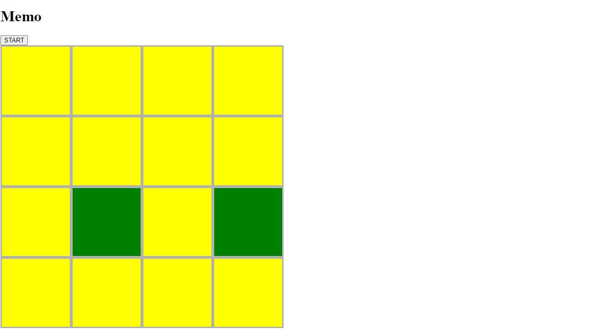

Memory game - you have to find two the same pictures. Each game generates different pictures.

Technologies: HTML5,CSS3, JavaScript

Can be implemented (additional functionalities):

1. Zabezpieczenie kodu aby nie było możliwe wielokrotnie naciśnięcie przycisku "Start".
2. Zabezpieczenie aby nie można było wybrać innej karty w czasie 1 sek, podczas odliczania timer-a (setTimeout).
3. Zliczanie punktów (ruchów).
4. Możliwość zmiany wielkości tablicy do gry.
5. Odpowiednia wiadomość po odgadnięciu wszystkich kart.
